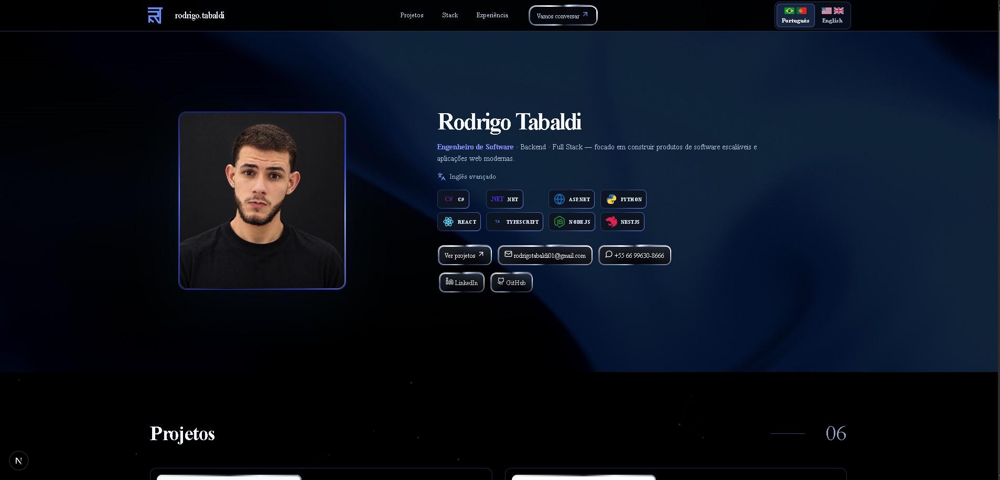
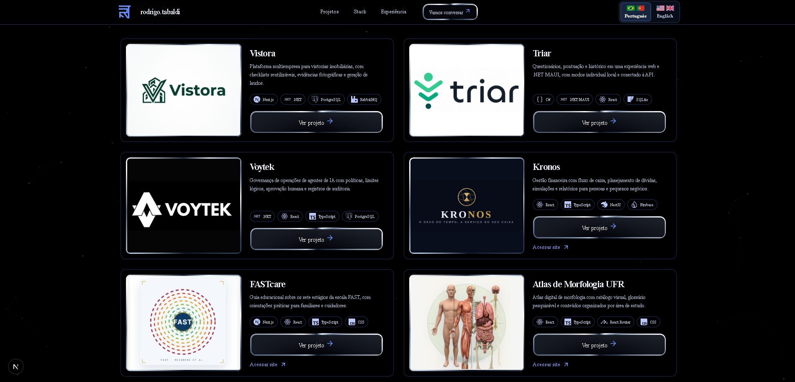
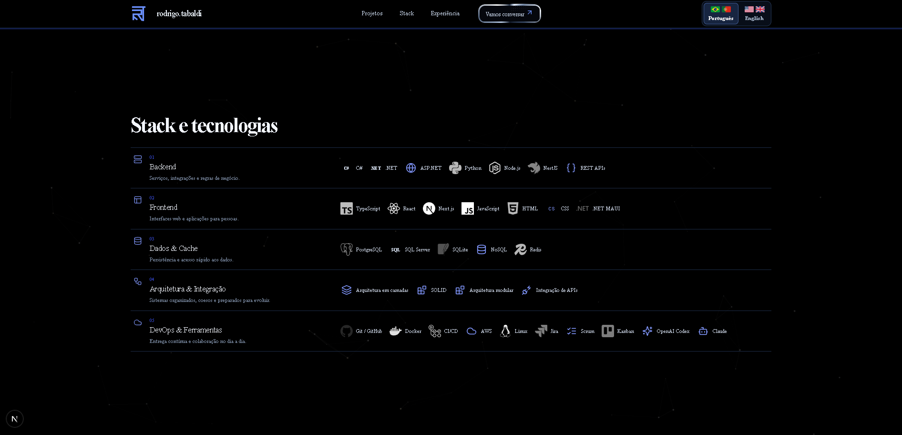
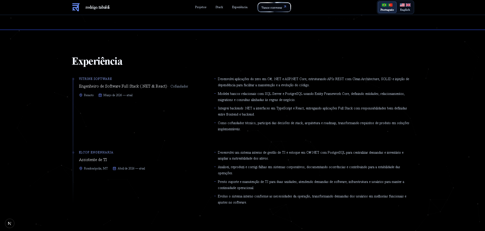
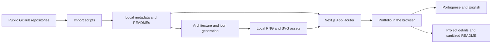
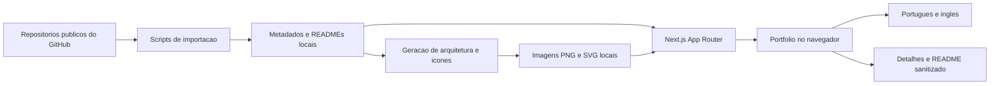

# Rodrigo Tabaldi — Portfolio

**Personal software engineering portfolio with selected projects, technical skills, professional experience, and contact information.**

[English](#english) | [Português](#português) · [Source code](https://github.com/RodrigoTabaldi/Portifolio)

[](https://nextjs.org/)
[](https://react.dev/)
[](https://www.typescriptlang.org/)

## English

### Overview

This repository contains Rodrigo Tabaldi's personal portfolio. It presents his work as a software engineer focused on backend and full stack development, bringing together six selected projects, technologies, professional experience, advanced English proficiency, and direct contact links.

The interface supports Portuguese and English, with a dark theme, blue accents, animated backgrounds, and project dialogs containing full READMEs, screenshots, technology icons, and available architecture diagrams.

### Key features

- Professional introduction with portrait, focus areas, and advanced English proficiency.
- Six projects: Vistora, Triar, Voytek, Kronos, FASTcare, and Atlas de Morfologia UFR.
- Project details with complete READMEs, image galleries, local technology icons, and architecture diagrams generated from the source READMEs.
- Source-code links and live websites for projects with a published web version.
- Technology groups covering backend, frontend, data, architecture, and DevOps.
- Professional experience and contacts through email, WhatsApp, LinkedIn, and GitHub.
- Portuguese and English buttons with Brazil, Portugal, US, and UK flags.
- Responsive layouts, skip navigation, keyboard focus styling, and reduced-motion handling for CSS animations and star fields.

### Screenshots

The four PNG captures below show the desktop interface.

| Introduction | Projects |
|:---:|:---:|
|  |  |

| Technologies | Experience |
|:---:|:---:|
|  |  |

### Tech stack

| Area | Technologies |
|---|---|
| Application | Next.js 16 App Router, React 19, TypeScript 5 |
| Interface | CSS, Lucide React, next/image |
| Motion | CSS animations, Canvas 2D, WebGL, Motion |
| README rendering | react-markdown, remark-gfm, rehype-raw, rehype-sanitize, rehype-slug |
| Documentation assets | Mermaid CLI, Simple Icons, local Markdown, PNG, and SVG files |
| Quality | ESLint, TypeScript compiler, production build, asset-verification script |

### Architecture

Next.js serves the page and static assets. React client components manage language selection and project dialogs. Project summaries and imported metadata are local; opening a project loads its local README on demand. Markdown and embedded HTML pass through sanitization before rendering.

Import scripts run during content maintenance, rather than during normal navigation. Mermaid diagrams are generated as SVG files beforehand. There is no custom API, database, or authentication flow.



### Project structure

```text
src/
  app/                 Page, layout, metadata, and global CSS
  components/          Navigation, projects, language, backgrounds, and UI
  data/                Selected projects and imported repository metadata
public/
  images/              Portrait and project covers
  github/              Imported repository images
  readmes/             Local READMEs and untouched source copies
  architectures/       Generated architecture diagrams
  technology-icons/    Local technology icons
scripts/               Import, asset generation, and verification
docs/images/           Four portfolio screenshots used in this README
```

### Run locally

Use Node.js 22.12 or newer and npm. From the repository directory:

```bash
npm install
npm run dev
```

Open [http://localhost:3000](http://localhost:3000). No database, API keys, or environment file is required for the portfolio itself.

For development access from another device, use the computer's LAN address and add its hostname/IP to `allowedDevOrigins` in `next.config.ts`.

### Checks and production

```bash
npm run lint
npm run typecheck
npm run verify:projects
npm run build
npm start
```

`verify:projects` checks imported README sections, images, diagrams, icons, Markdown tables, and HTML sanitization. It does not test browser interactions.

### Update project content

```bash
npm run sync:projects
```

This imports public repository metadata, READMEs, referenced images, and screenshots, then prepares icons and available Mermaid diagrams. The importer may store additional repositories; `src/data/projects.ts` controls the six displayed projects. GitHub changes require a new import.

Asset generation needs a Chromium-based browser. On Windows, the script defaults to the standard Microsoft Edge installation path. For another executable, set `PROJECT_DIAGRAM_BROWSER` to its full path before running `npm run prepare:project-assets`.

## Português

### Visão geral

Este repositório contém o portfólio pessoal de Rodrigo Tabaldi. O site apresenta sua atuação como engenheiro de software com foco em backend e desenvolvimento full stack, reunindo seis projetos selecionados, tecnologias, experiência profissional, inglês avançado e canais de contato.

A interface oferece português e inglês, tema escuro com detalhes azuis, fundos animados e detalhes dos projetos com READMEs completos, capturas, ícones de tecnologias e diagramas de arquitetura disponíveis.

### Principais funcionalidades

- Apresentação profissional com foto, áreas de atuação e inglês avançado.
- Seis projetos: Vistora, Triar, Voytek, Kronos, FASTcare e Atlas de Morfologia UFR.
- Detalhes com README completo, galeria, ícones locais e diagramas gerados a partir dos READMEs de origem.
- Links para código e documentação, além das versões web dos projetos publicados.
- Tecnologias organizadas em backend, frontend, dados, arquitetura e DevOps.
- Experiência profissional e contatos por e-mail, WhatsApp, LinkedIn e GitHub.
- Seleção entre português e inglês, com bandeiras de Brasil, Portugal, EUA e Reino Unido.
- Layout responsivo, atalho para o conteúdo, foco por teclado e tratamento de movimento reduzido nas animações CSS e nos campos de estrelas.

### Capturas de tela

As quatro imagens PNG abaixo mostram a interface no computador.

| Apresentação | Projetos |
|:---:|:---:|
|  |  |

| Tecnologias | Experiência |
|:---:|:---:|
|  |  |

### Tecnologias utilizadas

| Área | Tecnologias |
|---|---|
| Aplicação | Next.js 16 App Router, React 19, TypeScript 5 |
| Interface | CSS, Lucide React, next/image |
| Animações | CSS, Canvas 2D, WebGL, Motion |
| Renderização de READMEs | react-markdown, remark-gfm, rehype-raw, rehype-sanitize, rehype-slug |
| Documentação | Mermaid CLI, Simple Icons, arquivos locais Markdown, PNG e SVG |
| Qualidade | ESLint, compilador TypeScript, build e verificação dos recursos |

### Arquitetura

O Next.js serve a página e os recursos estáticos. Componentes React controlam o idioma e os detalhes dos projetos. Resumos e metadados ficam em arquivos locais; ao abrir um projeto, seu README é carregado sob demanda. Markdown e HTML incorporado passam por sanitização antes da renderização.

Os scripts são executados durante a manutenção do conteúdo. A navegação normal não consulta o GitHub. Os diagramas Mermaid são convertidos previamente em SVG. O portfólio não possui API própria, banco de dados ou autenticação.



### Executar localmente

Use Node.js 22.12 ou superior e npm. Na pasta do repositório:

```bash
npm install
npm run dev
```

Abra [http://localhost:3000](http://localhost:3000). O portfólio não exige banco, chaves de API ou arquivo de variáveis de ambiente.

Para acessar o servidor de desenvolvimento por outro dispositivo, use o endereço de rede do computador e inclua seu hostname/IP em `allowedDevOrigins`, no arquivo `next.config.ts`.

### Verificação e produção

```bash
npm run lint
npm run typecheck
npm run verify:projects
npm run build
npm start
```

O comando `verify:projects` verifica seções dos READMEs, imagens locais, diagramas, ícones, tabelas Markdown e sanitização de HTML. Ele não testa interações no navegador.

### Atualizar o conteúdo

```bash
npm run sync:projects
```

O comando importa metadados, READMEs, imagens referenciadas e capturas dos repositórios públicos, depois prepara os ícones e diagramas disponíveis. A importação pode guardar dados de outros repositórios; `src/data/projects.ts` define os seis projetos exibidos. Alterações no GitHub exigem uma nova importação.

A geração precisa de um navegador baseado em Chromium. No Windows, o script usa por padrão o caminho convencional do Microsoft Edge. Para outro executável, configure `PROJECT_DIAGRAM_BROWSER` com seu caminho completo antes de executar `npm run prepare:project-assets`.

### Autor / Author

**Rodrigo Tabaldi** · Engenheiro de Software / Software Engineer · Backend / Full Stack

[GitHub](https://github.com/RodrigoTabaldi) · [LinkedIn](https://www.linkedin.com/in/rodrigotabaldi/) · [E-mail](mailto:rodrigotabaldi01@gmail.com)
