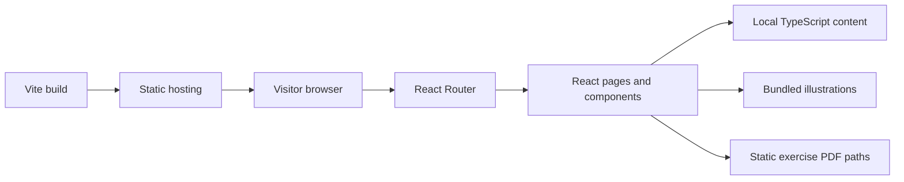
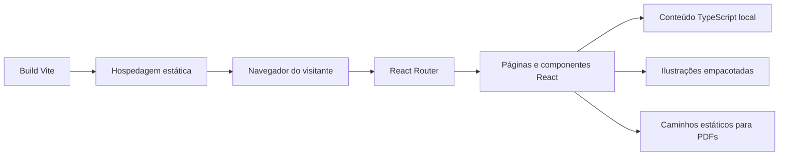

# Atlas de Morfologia UFR

**A digital morphology atlas for cell biology, histology, embryology and human anatomy.**

[English](#english) | [Português](#português)

[](https://react.dev/)
[](https://www.typescriptlang.org/)
[](https://vite.dev/)
[](https://reactrouter.com/)

<a id="english"></a>
## English

### Overview

Atlas de Morfologia UFR (also presented in the interface as **Morfologia em Foco**) is a digital learning project from the Federal University of Rondonópolis (UFR). It brings together a visual catalog of 15 morphology topics, a searchable academic glossary and topic-based exercise pages.

The project aims to support morphology teaching and learning at UFR and to grow into a resource used across Brazil. Nationwide use is an objective of the project, not a claim about its current reach.

### The problem it addresses

Morphology study spans cell biology, tissues, embryonic development and anatomy. The atlas provides one navigable place to organize these subjects and their visual references, with room for reviewed descriptions and practical learning material as the project develops.

### Key features

- Browse 15 topics through a responsive catalog and shared topic-page template.
- Search glossary definitions and filter by Cytology, Histology, Embryology or Anatomy.
- Browse exercise availability by topic; the current repository has no published exercise PDFs.
- Use responsive navigation and topic-to-topic links.
- View locally bundled illustrations, with separate full-size and card-sized topic images.
- Respect the operating system's reduced-motion preference.

### Screenshots

| Home | Topic page |
|:---:|:---:|
|  |  |

| Exercises | Glossary |
|:---:|:---:|
|  |  |

### Tech stack

| Area | Technologies and evidence |
|---|---|
| Frontend | React 19, TypeScript 6, React Router 7, CSS |
| Backend | None; there is no server API or authentication in this repository |
| Database | None; topics, glossary terms and exercise metadata are TypeScript data |
| Infrastructure | Vite development/build tooling; `vercel.json` configures SPA route rewrites for Vercel. No Docker or CI/CD configuration is present |
| Tools | npm, TypeScript compiler, Oxlint |

### Architecture

The browser loads a single-page React application. React Router maps URLs to page components; topic, glossary and exercise metadata is imported from local TypeScript modules. Vite bundles the application and its image assets. There is no server API or persistent data layer in this repository.



### Simplified project structure

```text
src/
├── assets/          # UFR identity, hero and topic illustrations
├── components/      # Shared layout and topic cards
├── data/            # Topic, glossary and exercise metadata
├── hooks/           # Viewport visibility hook
├── pages/           # Home, topic, exercises, glossary and about pages
├── styles/          # Theme tokens and topic accent helpers
├── App.tsx          # Route definitions
└── main.tsx         # React entry point and browser router
public/
└── exercicios/      # Static PDFs (none currently published)
docs/images/         # Project screenshots used in this README
```

### Technical decisions

- **Shared topic template:** all 15 topic URLs use one page component backed by topic data, keeping presentation consistent and content additions localized.
- **Static content modules:** topic definitions, glossary entries and exercise links are plain TypeScript data. This matches the current read-only scope without adding a database or API dependency.
- **Two illustration sizes:** topic illustrations have full-size and card-size WebP variants to avoid loading large images in the home grid.
- **CSS motion and theme tokens:** transitions and accent colors use CSS, avoiding a UI or animation dependency; motion is disabled when reduced motion is requested.
- **SPA hosting rewrite:** `vercel.json` sends application routes to `index.html`, so client-side routes can be opened directly on Vercel.

### Engineering Highlights

- Typed content models for topics, glossary terms and exercise files.
- Client-side routing with parameterized topic pages and adjacent-topic navigation.
- Search and category filtering over locally maintained glossary content.
- Reusable React components and data-driven page rendering.
- Responsive interface, image fallbacks and reduced-motion support.
- Static asset delivery configured for single-page application hosting.

### API

There is no API in this repository. The application does not make backend requests.

### Data model

There is no database. The main TypeScript data shapes are:

- `Topic`: slug, title, discipline, summary, planned content type, status, accent and illustration references.
- `GlossaryTerm`: term, definition and subject area.
- `ExerciseFile`: topic slug, display title, static PDF path and optional description.

### Run locally

#### Prerequisites

- Node.js compatible with the installed Vite version (Node.js 20.19+ or 22.12+).
- npm.

#### Install and run

```bash
git clone https://github.com/RodrigoTabaldi/Atlas-Morfologia-UFR.git
cd Atlas-Morfologia-UFR
npm ci
npm run dev
```

Open the local URL printed by Vite (usually `http://localhost:5173`).

Other available commands:

```bash
npm run build    # type-check and create the production bundle in dist/
npm run preview  # serve the production bundle locally
npm run lint     # run Oxlint
```

### Environment variables

No environment variables are required by the current application.

### Challenges & learnings

The implementation separates high-resolution topic artwork from smaller catalog thumbnails, and centralizes 15 topic pages in one data-driven template. These choices reduce duplicated page markup and unnecessary image weight in the catalog. The current content model also makes the boundary clear between illustrative scaffolding and material that still needs to be produced and reviewed.

### Roadmap

**Implemented in the current codebase**

- Responsive navigation and a catalog for 15 morphology topics.
- Topic pages with illustrative images, status and planned content metadata.
- Searchable, subject-filtered glossary.
- Topic-based exercise listing and static PDF link support.
- Vite build and Vercel single-page route rewrite configuration.

**Planned / in progress**

- Complete and review the descriptions and highlighted structures for each topic.
- Replace illustrative references with UFR collection material as it becomes available.
- Develop the planned interactive diagrams and image galleries.
- Publish exercise PDFs and continue expanding the glossary.
- Advance the project toward its goal of nationwide use.

### Project status

**In development.** All 15 topic routes are scaffolded; the cell topic is marked in production and the other 14 are planned. Topic descriptions and highlighted structures are placeholders. No exercise PDF is currently registered. The repository contains the frontend only.

### Author

**Rodrigo Tabaldi**
<br />
Software Engineering student focused on Backend Development, .NET and Full Stack applications.

[GitHub repository](https://github.com/RodrigoTabaldi/Atlas-Morfologia-UFR)

---

<a id="português"></a>
## Português

### Visão geral

O **Atlas de Morfologia UFR**, também apresentado na interface como **Morfologia em Foco**, é um projeto educacional digital da Universidade Federal de Rondonópolis (UFR). Ele reúne um catálogo visual com 15 tópicos de morfologia, um glossário acadêmico pesquisável e páginas de exercícios organizadas por tópico.

O projeto busca apoiar o ensino e o estudo da morfologia na UFR e crescer como recurso de alcance nacional. O uso em todo o Brasil é um objetivo do projeto, não uma afirmação sobre seu alcance atual.

### Problema que resolve

O estudo da morfologia abrange biologia celular, tecidos, desenvolvimento embrionário e anatomia. O atlas oferece um único espaço navegável para organizar esses assuntos e suas referências visuais, com estrutura para receber descrições revisadas e materiais práticos à medida que o projeto avança.

### Principais funcionalidades

- Navegação por 15 tópicos em um catálogo responsivo e páginas baseadas em um modelo compartilhado.
- Busca no glossário e filtro por Citologia, Histologia, Embriologia ou Anatomia.
- Consulta de exercícios por tópico; o repositório ainda não tem PDFs de exercícios publicados.
- Navegação responsiva e links entre tópicos adjacentes.
- Ilustrações locais, com versões em alta resolução e versões menores para os cartões.
- Respeito à preferência do sistema operacional por movimento reduzido.

### Capturas de tela

| Página inicial | Página de tópico |
|:---:|:---:|
|  |  |

| Exercícios | Glossário |
|:---:|:---:|
|  |  |

### Tecnologias

| Área | Tecnologias e evidências |
|---|---|
| Frontend | React 19, TypeScript 6, React Router 7, CSS |
| Backend | Não há backend, API de servidor ou autenticação neste repositório |
| Banco de dados | Não há banco; tópicos, termos e metadados dos exercícios são dados TypeScript |
| Infraestrutura | Vite para desenvolvimento e build; `vercel.json` configura rewrites de rotas SPA para a Vercel. Não há configuração de Docker ou CI/CD |
| Ferramentas | npm, compilador TypeScript, Oxlint |

### Arquitetura

O navegador carrega uma aplicação React de página única. O React Router associa URLs aos componentes; os metadados de tópicos, glossário e exercícios são importados de módulos TypeScript locais. O Vite empacota a aplicação e os recursos visuais. Este repositório não contém API de servidor nem camada de persistência.



### Estrutura simplificada

```text
src/
├── assets/          # Identidade visual da UFR, hero e ilustrações dos tópicos
├── components/      # Layout compartilhado e cartões dos tópicos
├── data/            # Metadados de tópicos, glossário e exercícios
├── hooks/           # Hook de visibilidade na viewport
├── pages/           # Início, tópicos, exercícios, glossário e sobre
├── styles/          # Tokens visuais e helpers de acentuação
├── App.tsx          # Definição das rotas
└── main.tsx         # Entrada React e roteador do navegador
public/
└── exercicios/      # PDFs estáticos (nenhum publicado atualmente)
docs/images/         # Capturas de tela usadas neste README
```

### Decisões técnicas

- **Modelo compartilhado de tópico:** as 15 URLs de tópicos usam um único componente baseado em dados, mantendo a apresentação consistente e centralizando a inclusão de conteúdo.
- **Módulos de conteúdo estático:** tópicos, termos do glossário e links de exercícios são dados TypeScript. Isso atende ao escopo atual, que é somente leitura, sem adicionar dependência de API ou banco.
- **Duas resoluções de ilustração:** os tópicos usam imagens WebP em tamanho completo e miniaturas menores no catálogo, reduzindo o peso carregado pela página inicial.
- **Animações CSS e tokens visuais:** transições e cores usam CSS, sem dependência de interface ou animação; o movimento é desativado quando o usuário solicita movimento reduzido.
- **Rewrite para hospedagem SPA:** `vercel.json` encaminha as rotas da aplicação para `index.html`, permitindo abrir diretamente as rotas do cliente na Vercel.

### Destaques de engenharia

- Modelos tipados para tópicos, termos do glossário e arquivos de exercícios.
- Rotas no cliente, páginas parametrizadas e navegação entre tópicos adjacentes.
- Busca e filtro por área em conteúdo local do glossário.
- Componentes React reutilizáveis e renderização orientada por dados.
- Interface responsiva, fallback de imagens e suporte a movimento reduzido.
- Entrega de recursos estáticos configurada para hospedagem de aplicação de página única.

### API

Este repositório não possui API. A aplicação não faz requisições a um backend.

### Dados

Não há banco de dados. Os principais formatos TypeScript são:

- `Topic`: slug, título, área, resumo, formato de conteúdo planejado, status, cor de destaque e referências às ilustrações.
- `GlossaryTerm`: termo, definição e área temática.
- `ExerciseFile`: slug do tópico, título, caminho estático do PDF e descrição opcional.

### Executar localmente

#### Pré-requisitos

- Node.js compatível com a versão do Vite instalada (Node.js 20.19+ ou 22.12+).
- npm.

#### Instalação e execução

```bash
git clone https://github.com/RodrigoTabaldi/Atlas-Morfologia-UFR.git
cd Atlas-Morfologia-UFR
npm ci
npm run dev
```

Abra o endereço local informado pelo Vite (normalmente `http://localhost:5173`).

Outros comandos disponíveis:

```bash
npm run build    # verifica os tipos e cria o pacote em dist/
npm run preview  # serve localmente o pacote de produção
npm run lint     # executa o Oxlint
```

### Variáveis de ambiente

A aplicação atual não exige variáveis de ambiente.

### Desafios e aprendizados

A implementação separa ilustrações em alta resolução das miniaturas do catálogo e centraliza as páginas dos 15 tópicos em um único modelo orientado por dados. Essas escolhas reduzem a duplicação de marcação e o peso de imagens desnecessariamente grandes no catálogo. O modelo de conteúdo também deixa clara a diferença entre a estrutura ilustrativa existente e o material que ainda precisa ser produzido e revisado.

### Roadmap

**Implementado no código atual**

- Navegação responsiva e catálogo com 15 tópicos de morfologia.
- Páginas de tópicos com imagens ilustrativas, status e metadados do conteúdo planejado.
- Glossário com busca e filtro por área.
- Lista de exercícios por tópico e suporte a links de PDFs estáticos.
- Build com Vite e configuração de rotas SPA para Vercel.

**Planejado / em andamento**

- Completar e revisar as descrições e estruturas em destaque de cada tópico.
- Substituir referências ilustrativas por material do acervo da UFR conforme sua disponibilidade.
- Desenvolver os diagramas interativos e as galerias de imagens planejados.
- Publicar PDFs de exercícios e ampliar o glossário.
- Avançar em direção ao objetivo de uso em escala nacional.

### Status do projeto

**Em desenvolvimento.** As rotas dos 15 tópicos estão estruturadas; o tópico célula está marcado como em produção e os outros 14 como planejados. As descrições e estruturas em destaque ainda são placeholders. Atualmente nenhum PDF de exercício está registrado. Este repositório contém somente o frontend.

### Autor

**Rodrigo Tabaldi**
<br />
Estudante de Engenharia de Software com foco em desenvolvimento Backend, .NET e aplicações Full Stack.

[Repositório no GitHub](https://github.com/RodrigoTabaldi/Atlas-Morfologia-UFR)

