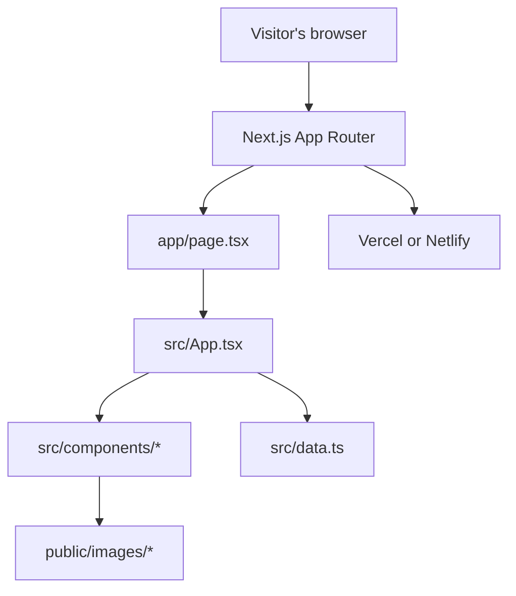
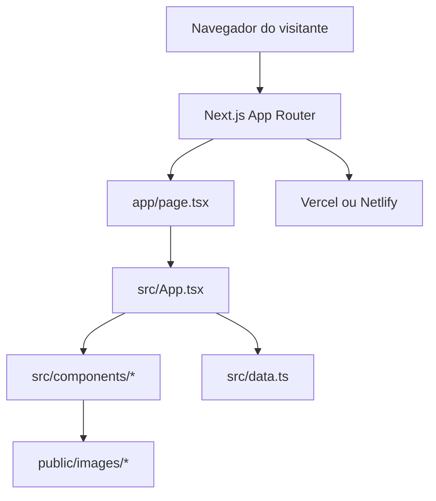

# FastCare

**An educational guide to the seven stages of the FAST scale, designed for families and caregivers.**

[English](#english) | [Português](#portugues) · [Source code](https://github.com/RodrigoTabaldi/FASTcare)

[](https://nextjs.org/)
[](https://react.dev/)
[](https://www.typescriptlang.org/)

<!-- Add a real product screenshot at docs/images/home.png before enabling this image. -->
<!--  -->

<a id="english"></a>

## Overview

FastCare is a Portuguese-language educational website about the seven stages of the Functional Assessment Staging Tool (FAST). It brings stage descriptions, observable signs, practical caregiver guidance, warning signs, and references together in one responsive page.

The project aims to make educational material easier to navigate for families and caregivers supporting older adults with suspected dementia. It does not provide a diagnosis or replace professional assessment or treatment.

## The problem it addresses

Information about cognitive and functional changes can be difficult to organize and discuss. FastCare presents the FAST stages and related guidance in a structured format, helping visitors observe changes and prepare for a conversation with a health professional. Its checklist is educational and does not determine a diagnosis.

## Features

- Browse the seven FAST stages and their signs, suggested actions, and indicated professionals.
- Open contextual tips and illustrations associated with stage content.
- Use a 20-item observation checklist grouped by topic; selected patterns suggest a FAST range for discussion with a health team.
- Read practical guidance on communication, meals, bathing, hygiene, and everyday care.
- Review warning signs that call for prompt medical attention.
- Browse an expandable glossary and copy ABNT or APA references.
- Navigate with responsive menus, keyboard controls for the stage selector, a table of contents, and a back-to-top control.
- See an educational-use notice when opening the site.

## Screenshots

The repository currently includes product illustrations, but no page screenshots. Add real captures to `docs/images/` and then remove the corresponding Markdown comments below.

<!-- TODO: Capture the real home page and save it as docs/images/home.png. -->
<!--  -->

<!-- TODO: Capture the interactive FAST stages and save it as docs/images/fast-stages.png. -->
<!--  -->

<!-- TODO: Capture the observation checklist and save it as docs/images/checklist.png. -->
<!--  -->

<!-- TODO: Capture the daily care guidance and save it as docs/images/care-guidance.png. -->
<!--  -->

## Tech stack

| Area | Technologies found in the project |
| --- | --- |
| Backend | No separate backend; the Next.js application renders the site and its client-side interactions. |
| Frontend | Next.js 15, React 18, TypeScript 5, CSS |
| Database | None; no database or persistence layer is configured. |
| Infrastructure | Next.js deployment configuration for Vercel; Netlify build configuration. |
| Tools | Node.js, npm, TypeScript compiler (`npm run lint`) |

Manrope and Roboto Mono are loaded from Google Fonts at runtime.

## Architecture

This is a single-page Next.js App Router application. `app/page.tsx` mounts the client-side experience in `src/App.tsx`; the interface is divided into React components, while the FAST stages, tips, and glossary content live in `src/data.ts`. Static illustrations are served from `public/images/`.

There is no custom REST API, database, authentication, or Docker setup in this repository. The checklist keeps its selection in React state for the current page session.



## Simplified project structure

```text
app/                  Next.js App Router entry point and metadata
src/
  App.tsx              Main page composition and shared UI state
  data.ts              FAST stages, tips, glossary, and navigation content
  hooks.ts             Scroll, reveal, section, and copy helpers
  components/          Page sections and interactive components
  styles.css           Global styles and responsive layout
public/images/         Illustrations and other static assets
docs/images/           Reserved for product screenshots
```

## Technical decisions

- **Next.js App Router:** provides the application entry point and the build/start workflow already configured in the repository.
- **React components and local state:** keep stage selection, glossary expansion, checklist choices, and other page interactions close to the interface that uses them. No server-side persistence is configured.
- **TypeScript:** types the stage and tip content and is checked by the existing `lint` script (`tsc --noEmit`).
- **Static content in source files:** fits the current educational, read-only content model; a database or API is not required by the implemented features.
- **Vercel and Netlify configuration:** records deployment settings for these hosting providers. Configuration files do not by themselves confirm that a live deployment exists.

## Engineering Highlights

- Composes a multi-section interface from focused React components.
- Models FAST stages and linked tips as typed TypeScript data.
- Connects checklist selections to a suggested FAST range and the interactive stage view.
- Implements client-side interactions, responsive navigation, accessible control labels, and reduced-motion styling.
- Organizes static illustrations for use in contextual guidance.
- Includes metadata, a public-font setup, and hosting-provider configuration.

## API

There is no custom API or API endpoint in this project. The site presents local content and client-side interactions.

## Data model

There is no database. The principal content structures are TypeScript definitions and constants in `src/data.ts`, including `Stage`, `TipCard`, FAST stage records, tips, glossary entries, and table-of-contents items. Checklist selections are held in component state and are not saved to a server or browser storage.

## Run locally

### Prerequisites

- Node.js 18.18 or later.
- npm.
- Internet access to load the configured Google Fonts while viewing the site.

### Install and run

```bash
git clone https://github.com/RodrigoTabaldi/FASTcare.git
cd FASTcare
npm ci
npm run dev
```

Open [http://localhost:3000](http://localhost:3000).

### Production build

```bash
npm run build
npm run start
```

The production server runs on port 3000 by default. `npm run lint` runs the TypeScript check; the repository does not define a dedicated test script or test suite.

## Environment variables

No environment variables are required by the current application. Do not add secrets to the repository.

## Challenges & Learnings

The current structure separates educational content from presentation: stage and tip records are typed in `src/data.ts`, while components render those records and coordinate interactions. The checklist-to-stage connection demonstrates how local UI state can link two sections without a backend. The repository does not document project-specific implementation challenges, so no further challenge claims are made here.

## Roadmap

**Implemented**

- Educational content for seven FAST stages.
- Interactive stage navigation and observation checklist.
- Everyday care guidance, warning signs, glossary, and academic citation helpers.
- Responsive interface and deployment configuration for Vercel and Netlify.

**Planned**

- Make the site available to visitors throughout Brazil (national coverage).
- Consider additional languages in a future iteration.
- Add real product screenshots to `docs/images/`.

These are plans; they are not claims of an existing nationwide service or multilingual interface.

## Project status

The repository contains a runnable Next.js application and hosting configuration. No live production URL or deployment status is documented in the repository. The interface content is currently in Brazilian Portuguese.

## Author

**Rodrigo Tabaldi**

Software Engineering student focused on Backend Development, .NET and Full Stack applications.

---

<a id="portugues"></a>

# FastCare

**Um guia educativo sobre as sete etapas da escala FAST, pensado para familiares e cuidadores.**

[English](#english) | [Português](#portugues) · [Código-fonte](https://github.com/RodrigoTabaldi/FASTcare)

[](https://nextjs.org/)
[](https://react.dev/)
[](https://www.typescriptlang.org/)

<!-- Adicione uma captura real da página inicial em docs/images/home.png antes de habilitar esta imagem. -->
<!--  -->

## Visão geral

FastCare é um site educativo, em português, sobre as sete etapas da Functional Assessment Staging Tool (FAST). O conteúdo reúne descrições das etapas, sinais observáveis, orientações práticas para cuidadores, sinais de alerta e referências em uma página responsiva.

O projeto busca facilitar a consulta de familiares e cuidadores de pessoas idosas com suspeita de demência. O material não fornece diagnóstico nem substitui avaliação ou tratamento por profissionais de saúde.

## Problema que o projeto resolve

Informações sobre mudanças cognitivas e funcionais podem ser difíceis de organizar e discutir. O FastCare apresenta as etapas FAST e orientações relacionadas de forma estruturada, ajudando visitantes a observar mudanças e preparar uma conversa com um profissional de saúde. O checklist é educativo e não determina um diagnóstico.

## Funcionalidades

- Consultar as sete etapas FAST, seus sinais, ações sugeridas e profissionais indicados.
- Abrir dicas contextuais e ilustrações associadas ao conteúdo das etapas.
- Preencher um checklist educativo de 20 sinais, organizado por tema; combinações selecionadas sugerem uma faixa FAST para conversar com a equipe de saúde.
- Consultar orientações práticas sobre comunicação, alimentação, banho, higiene e cuidados cotidianos.
- Ver sinais de alerta que exigem atendimento médico sem demora.
- Consultar um glossário expansível e copiar referências nos formatos ABNT ou APA.
- Navegar por menus responsivos, controles de teclado no seletor de etapas, sumário lateral e botão de volta ao topo.
- Visualizar um aviso sobre o uso educativo do material ao entrar no site.

## Capturas de tela

O repositório contém ilustrações do produto, mas não capturas de tela das páginas. Adicione capturas reais em `docs/images/` e remova os comentários Markdown correspondentes abaixo.

<!-- TODO: capture a página inicial real e salve como docs/images/home.png. -->
<!--  -->

<!-- TODO: capture as etapas FAST interativas e salve como docs/images/fast-stages.png. -->
<!--  -->

<!-- TODO: capture o checklist e salve como docs/images/checklist.png. -->
<!--  -->

<!-- TODO: capture as orientações de cuidados e salve como docs/images/care-guidance.png. -->
<!--  -->

## Tecnologias

| Área | Tecnologias encontradas no projeto |
| --- | --- |
| Backend | Não há backend separado; a aplicação Next.js renderiza o site e suas interações no cliente. |
| Frontend | Next.js 15, React 18, TypeScript 5, CSS |
| Banco de dados | Nenhum; não há banco de dados ou camada de persistência configurados. |
| Infraestrutura | Configuração de deploy Next.js para Vercel; configuração de build para Netlify. |
| Ferramentas | Node.js, npm, compilador TypeScript (`npm run lint`) |

As fontes Manrope e Roboto Mono são carregadas do Google Fonts durante o uso do site.

## Arquitetura

Esta é uma aplicação de página única com Next.js App Router. `app/page.tsx` monta a experiência do cliente em `src/App.tsx`; a interface é dividida em componentes React, enquanto etapas FAST, dicas e conteúdo do glossário ficam em `src/data.ts`. As ilustrações estáticas são servidas por `public/images/`.

Este repositório não contém API REST própria, banco de dados, autenticação ou configuração Docker. As seleções do checklist ficam no estado React durante a sessão atual da página.



## Estrutura simplificada

```text
app/                  Ponto de entrada e metadados do Next.js App Router
src/
  App.tsx              Composição da página e estado compartilhado da interface
  data.ts              Etapas FAST, dicas, glossário e navegação
  hooks.ts             Auxiliares de rolagem, revelação, seção ativa e cópia
  components/          Seções e componentes interativos da página
  styles.css           Estilos globais e layout responsivo
public/images/         Ilustrações e outros arquivos estáticos
docs/images/           Local reservado para capturas de tela
```

## Decisões técnicas

- **Next.js App Router:** fornece o ponto de entrada e o fluxo de build e execução já configurados no repositório.
- **Componentes React e estado local:** mantêm seleção de etapa, expansão do glossário, respostas do checklist e outras interações próximas da interface que as utiliza. Não há persistência no servidor configurada.
- **TypeScript:** tipa os dados das etapas e dicas e é verificado pelo script existente `lint` (`tsc --noEmit`).
- **Conteúdo estático nos arquivos-fonte:** atende ao modelo educativo e de leitura atual; os recursos implementados não exigem banco ou API.
- **Configurações para Vercel e Netlify:** registram opções para esses provedores. A existência de arquivos de configuração não confirma, por si só, um deploy ativo.

## Destaques de engenharia

- Composição de uma interface com várias seções a partir de componentes React focados.
- Modelagem tipada em TypeScript para etapas FAST e dicas relacionadas.
- Integração entre as seleções do checklist, a sugestão de faixa FAST e a visualização interativa das etapas.
- Interações no cliente, navegação responsiva, rótulos acessíveis e estilos que respeitam preferência por movimento reduzido.
- Organização de ilustrações estáticas para orientações contextuais.
- Inclusão de metadados, configuração de fontes e arquivos de configuração de hospedagem.

## API

O projeto não possui API própria nem endpoints. O site apresenta conteúdo local e interações no cliente.

## Dados

Não há banco de dados. As principais estruturas de conteúdo são tipos e constantes TypeScript em `src/data.ts`, incluindo `Stage`, `TipCard`, registros das etapas FAST, dicas, itens do glossário e do sumário. As seleções do checklist ficam no estado do componente e não são salvas no servidor nem no armazenamento do navegador.

## Executar localmente

### Pré-requisitos

- Node.js 18.18 ou posterior.
- npm.
- Acesso à internet para carregar as fontes configuradas no Google Fonts durante a visualização do site.

### Instalação e execução

```bash
git clone https://github.com/RodrigoTabaldi/FASTcare.git
cd FASTcare
npm ci
npm run dev
```

Abra [http://localhost:3000](http://localhost:3000).

### Build de produção

```bash
npm run build
npm run start
```

Por padrão, o servidor de produção usa a porta 3000. `npm run lint` executa a verificação TypeScript; o repositório não define um script ou uma suíte de testes dedicada.

## Variáveis de ambiente

A aplicação atual não exige variáveis de ambiente. Não adicione secrets ao repositório.

## Desafios e aprendizados

A estrutura separa conteúdo educativo e apresentação: etapas e dicas são tipadas em `src/data.ts`, enquanto os componentes exibem os dados e coordenam as interações. A ligação entre checklist e etapas demonstra como o estado local pode conectar seções sem backend. O repositório não documenta desafios específicos de implementação, por isso não fazemos outras afirmações sobre desafios.

## Roadmap

**Concluído**

- Conteúdo educativo para as sete etapas FAST.
- Navegação interativa pelas etapas e checklist de observação.
- Orientações de cuidados cotidianos, sinais de alerta, glossário e recursos de citação acadêmica.
- Interface responsiva e configurações de deploy para Vercel e Netlify.

**Planejado**

- Disponibilizar o site para visitantes em todo o Brasil (alcance nacional).
- Considerar outros idiomas em uma etapa futura.
- Adicionar capturas reais do produto em `docs/images/`.

Esses itens são planos; não afirmam que o serviço já tenha alcance nacional ou uma interface multilíngue.

## Status do projeto

O repositório contém uma aplicação Next.js executável e configurações para hospedagem. Não há URL pública de produção nem status de deploy documentados no repositório. Atualmente, o conteúdo da interface está em português brasileiro.

## Autor

**Rodrigo Tabaldi**

Estudante de Engenharia de Software com foco em desenvolvimento Backend, .NET e aplicações Full Stack.
