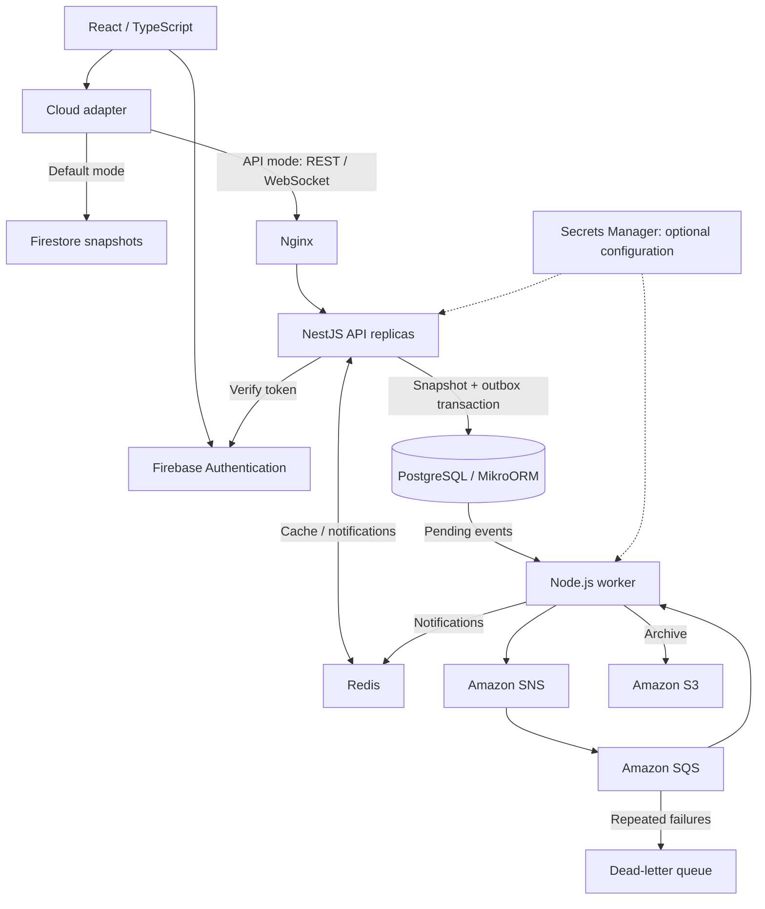
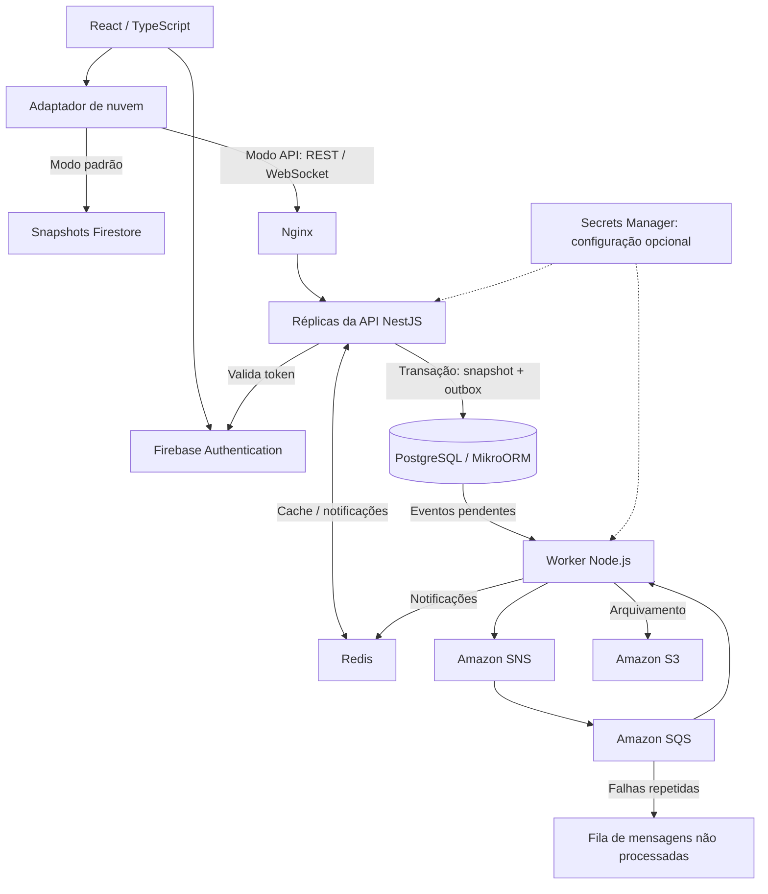

# Kronos

**Financial management and debt repayment planning for individuals, freelancers and small businesses.**

[English](#english) | [Português](#portugues)


<p align="center">
  
</p>

<!-- Main screenshot pending: add docs/images/dashboard.png and replace the brand artwork with that real capture. -->

<a id="english"></a>

## English

### Overview

Kronos brings income, expenses, debts and financial scenarios into one web application. Users can track cash flow, compare repayment strategies and evaluate business decisions through calculators and reports. The application interface is currently in Brazilian Portuguese.

**Status: MVP in development.** React provides the interface; Firebase is the default persistence mode. An optional NestJS backend adds PostgreSQL, Redis, WebSockets and an asynchronous archive worker. Cloud deployment and the complete distributed flow have not been validated in this workspace.

### The problem

Financial records alone do not explain which debt to pay first, how much interest costs or whether a business can cover its expenses. Kronos connects those records to repayment simulations, cash-flow indicators and practical next-action recommendations.

### Key features

| Area / route | What users can do |
| --- | --- |
| Accounts — `/login`, `/cadastro`, `/settings` | Sign in with email/password and configure individual/business profiles, income, tax regime and logo. |
| Dashboard — `/dashboard` | Review income, expenses, cash flow, categories, alerts and a debt summary. |
| Transactions — `/transacoes` | Create, edit, delete, filter and sort entries; track paid/pending status. |
| Debt planning — `/dividas` | Compare Avalanche and Snowball strategies, assess debt health and simulate refinancing and renegotiation. |
| Kairós — `/copiloto` | Receive prioritized recommendations calculated by local rules, without an external AI model. |
| Reports and receipts — `/relatorios`, `/notas-fiscais` | View a simplified income statement, export CSV and print reports or receipts through the browser. |
| Calculators — `/viabilidade`, `/impostos`, `/investimentos` | Explore break-even, margins, tax estimates, compound interest, financing, inflation and consortium scenarios. |
| Advanced analysis — `/analises/*` | Forecast cash flow and examine benchmarking, personal spending, working capital, expense anomalies, pricing, service mix, ROI, profit changes, decisions, biases and saved scenarios. |

### Screenshots

Only brand artwork is available; the cover above is a logo, not a screen capture. [Screenshot instructions](docs/images/README.md) describe the four planned images. No placeholder image files or broken gallery links are included.

<!-- Add real captures before enabling a two-column gallery:
docs/images/dashboard.png — cash flow and indicators at /dashboard
docs/images/login.png — authentication at /login
docs/images/main-feature.png — debt strategy comparison at /dividas
docs/images/reports.png — monthly report at /relatorios
Use fictional demonstration data, without personal information.
-->

### Tech stack

| Layer | Technologies and scope |
| --- | --- |
| **Backend** | Node.js 24, NestJS 11, TypeScript, Express, Socket.IO, Zod, Firebase Admin and AWS SDK. |
| **Frontend** | React 19, TypeScript strict mode, Vite 6, React Router, Tailwind CSS, React Hook Form, Zod and Lucide icons. |
| **Database** | Firestore in default mode; PostgreSQL 17 with MikroORM 6 and JSONB snapshots in API mode; Redis 7 for cache and Pub/Sub. |
| **Infrastructure** | Multi-stage Docker builds, Compose, Nginx, LocalStack and SNS/SQS/S3/Secrets Manager integrations. Terraform and Kubernetes files are deployment foundations, not evidence of a live environment. |
| **Tools** | npm, Git, Vitest and GitHub Actions CI. Vercel/Netlify SPA configurations are included. |

### Architecture

Both modes use Firebase Authentication. `StoreProvider` owns React state, while `lib/cloud.ts` selects the persistence adapter. Changes are saved after an approximately 800 ms debounce; financial calculations remain in client-side TypeScript.

In API mode, NestJS separates transport, application coordination, domain validation and infrastructure. API and worker run as separate processes. Nginx routes traffic to two API replicas; Redis distributes account-specific change notifications. WebSockets tell clients to reload through authenticated REST rather than transmitting financial snapshots.



Compose emulates SNS/SQS/S3 with LocalStack. The diagram describes the implemented topology, not an active AWS deployment.

### Project structure

```text
src/                       React entry point, protected routes and pages
components/                Layouts, charts, UI and visual effects
lib/                       Types, financial calculations, state and cloud adapters
backend/src/
  domain/                  Snapshot validation and domain tests
  infrastructure/          MikroORM entities, migration, Redis and configuration
  *.ts                     REST API, auth, gateway, worker and import script
infra/
  nginx/                   Static hosting, load balancer and rate limiting
  localstack/              Local SNS/SQS/S3 initialization
  terraform/               AWS messaging, storage, secrets and IAM definitions
  kubernetes/              Deployment and Service manifests
docs/                      Backend operations and screenshot instructions
public/brand/              Existing brand assets
supabase/schema.sql        Relational design reference; not the runtime schema
.github/workflows/ci.yml    Frontend/backend build and test checks
compose.yaml               Local service topology
```

### Technical decisions

| Decision | Reason and tradeoff |
| --- | --- |
| Two persistence adapters | Supports migration without rewriting screens or immediately moving existing Firebase accounts. |
| PostgreSQL JSONB snapshots | Preserves the current state contract; financial records are not yet normalized into individual tables. |
| Transactional outbox | Saves state and its event atomically, allowing publication to retry after messaging failures. |
| Stable S3 key per event | Repeated delivery writes the same archive object instead of creating duplicates. |
| Versioned Redis cache | Uses the current database version in the key; cache read failures fall back to PostgreSQL. |
| Authenticated account rooms | Derives the WebSocket room from the verified UID instead of trusting a client-supplied account ID. |
| Calculation functions and lazy analysis routes | Makes the debt engine testable and loads advanced pages on demand. |

### Engineering Highlights

- **REST integration and dependency injection:** NestJS controllers/services and a React adapter share the existing state contract.
- **Authentication and input validation:** Firebase token/revocation checks, ownership validation, duplicate-ID rejection, CORS and Helmet headers.
- **Database coordination:** versioned migrations, snapshot/outbox foreign key and PostgreSQL advisory locks for per-account writes.
- **Asynchronous processing:** SNS → SQS delivery, retries, a DLQ and idempotent S3 writes.
- **Operations:** readiness checks, request IDs, structured HTTP logs, containers and Nginx request limiting.
- **CI and tests:** financial-rule and failure-path tests; GitHub Actions checks both applications. CI does not deploy the project.

### API

| Method | Endpoint | Purpose | Authentication |
| --- | --- | --- | --- |
| `GET` | `/api/snapshot` | Read the account snapshot; `null` if none exists. | Firebase bearer token |
| `PUT` | `/api/snapshot` | Validate/save the complete snapshot and return its version. | Firebase bearer token |
| `GET` | `/api/health` | Check the running API process. | Public |
| `GET` | `/api/health/ready` | Check PostgreSQL and Redis connections. | Public |

Socket.IO emits `snapshot.ready` after authentication and `snapshot.changed` after updates. Expired sessions disconnect; the client refreshes its token and reconnects. There are no separate transaction/debt CRUD or NestJS login endpoints: UI operations save snapshots, and Firebase handles identity.

### Database and entities

| Storage | Model |
| --- | --- |
| Firestore | `kronos_snapshots/{uid}`; rules compare the authenticated UID to the document ID. |
| PostgreSQL `snapshots` | `user_id` primary key, JSONB `data`, `version`, `updated_at`. |
| PostgreSQL `outbox` | Event UUID, `user_id` foreign key, snapshot version/data, creation/publication/archive timestamps. |

Snapshots contain profiles, transactions, clients, categories, receipts, taxes, simulations, analyses, scenarios, personal expenses and debts. Core monetary fields use integer cents. The migration adds pending-event and transaction JSONB indexes. [`supabase/schema.sql`](supabase/schema.sql) is a separate design reference, not a runtime Supabase integration.

### Run locally

#### Prerequisites

- Node.js **24** and npm, matching CI and Docker images.
- A Firebase project with email/password authentication; Firestore for default mode.
- Docker Engine/Desktop with Compose and Firebase Admin credentials for API mode.
- Terraform/Kubernetes tooling only for the optional infrastructure configurations.

#### React + Firebase — default mode

From the repository root:

```bash
npm ci
```

Create the environment file for your shell:

```powershell
# Windows / PowerShell
Copy-Item .env.example .env
```

```bash
# macOS / Linux
cp .env.example .env
```

Fill in the Firebase web configuration, keep `VITE_CLOUD_BACKEND=firebase`, enable email/password sign-in and create Firestore. Publish the versioned rules, then start the application:

```bash
npx firebase-tools login
npx firebase-tools deploy --only firestore:rules --project YOUR_PROJECT_ID
npm run dev
```

Open the URL printed by Vite, usually `http://localhost:5173`. New accounts start with empty financial collections and generic categories.

#### React + NestJS — Docker mode

Copy `backend/.env.example` to `backend/.env` with `Copy-Item` or `cp`; set the same Firebase project as the frontend. Compose loads that file into the API, worker and migration. Configure the read-only Firebase Admin credential mount using [the backend guide](docs/backend.md#execução-local), creating the local `compose.credentials.yaml` override shown there.

```bash
docker compose -f compose.yaml -f compose.credentials.yaml config --quiet
docker compose -f compose.yaml -f compose.credentials.yaml up --build
```

Open `http://localhost:8080`. Migration runs before the API replicas; the Docker frontend build selects API mode. Existing accounts must be imported before switching: follow [the migration procedure](docs/backend.md#migração-de-contas-existentes), including the final write pause and comparison of imported data. The import skips PostgreSQL accounts that already exist.

<details>
<summary>Backend commands without Docker</summary>

Provide reachable PostgreSQL, Redis and AWS/LocalStack services. Adjust `backend/.env` addresses and `FRONTEND_ORIGIN`; Compose service names are not host addresses. Configure Firebase Admin Application Default Credentials outside the repository.

```bash
npm ci --prefix backend
npm run build --prefix backend
node --env-file=backend/.env backend/dist/backend/src/migrate.js
node --env-file=backend/.env backend/dist/backend/src/main.js
# Separate terminal:
node --env-file=backend/.env backend/dist/backend/src/worker.js
```

For Vite, select `VITE_CLOUD_BACKEND=api`, point `VITE_API_URL` at the API origin and match `FRONTEND_ORIGIN` to Vite's origin. Backend npm scripts do not automatically load `.env`; these commands load it explicitly.

</details>

### Environment variables

Use [`.env.example`](.env.example) and [`backend/.env.example`](backend/.env.example). Never commit local environment or service-account files.

| Frontend variables | Purpose |
| --- | --- |
| `VITE_FIREBASE_API_KEY`, `VITE_FIREBASE_AUTH_DOMAIN`, `VITE_FIREBASE_PROJECT_ID` | Firebase web configuration and authentication. |
| `VITE_FIREBASE_STORAGE_BUCKET`, `VITE_FIREBASE_MESSAGING_SENDER_ID`, `VITE_FIREBASE_APP_ID` | Remaining Firebase SDK configuration; these do not represent implemented upload/push-notification workflows. |
| `VITE_CLOUD_BACKEND` | `firebase` by default; `api` selects NestJS. |
| `VITE_API_URL` | API origin for Vite; empty uses the browser origin in Docker. |

| Backend variables | Purpose |
| --- | --- |
| `DATABASE_URL`, `REDIS_URL` | PostgreSQL and Redis connections. |
| `FIREBASE_PROJECT_ID`, `FRONTEND_ORIGIN` | Identity project and allowed browser origin. |
| `SNS_TOPIC_ARN`, `SQS_QUEUE_URL`, `S3_BUCKET` | Required messaging/archive destinations in the shared configuration loader. |
| `PORT`, `AWS_REGION` | Optional; default to `3000` and `us-east-1`. |
| `AWS_ENDPOINT_URL` | Optional LocalStack endpoint; omit for AWS. |
| `AWS_SECRET_ID` | Optional Secrets Manager entry containing `DATABASE_URL` and `REDIS_URL`. |
| `GOOGLE_APPLICATION_CREDENTIALS` | Server credential file path, when using a service account. |
| `AWS_ACCESS_KEY_ID`, `AWS_SECRET_ACCESS_KEY` | LocalStack placeholders in the local example; prefer workload IAM roles in AWS. |

`VITE_*` values enter the browser bundle: do not put server secrets there. Optional `FIREBASE_AUTH_EMULATOR_HOST` affects the backend; the frontend does not automatically connect to the emulator.

### Tests and build

```bash
npm run build
npm test
npm run test:watch
npm ci --prefix backend
npm run build --prefix backend
npm test --prefix backend
```

Last local verification: **21 debt-engine tests, 20 backend tests and both builds passed**. Service tests use simulated dependencies and do not prove real Firebase/PostgreSQL/AWS or multi-replica integration. [CI](.github/workflows/ci.yml) checks types, tests and builds on pull requests and pushes to `main`.

Build outputs `dist/`; `npm run preview` serves it locally. Vercel/Netlify configurations include SPA fallback. Set frontend environment variables at build time and deploy the backend separately in API mode. [Backend operations](docs/backend.md) cover credentials, infrastructure and logs.

### Challenges & Learnings

- **Changing persistence while preserving the UI:** the adapter and JSONB contract enable an incremental migration, with whole-snapshot last-write-wins behavior as a tradeoff.
- **Coordinating writes and messages:** the outbox handles the commit/publication gap; duplicate delivery still requires idempotent consumers.
- **Synchronizing clients across replicas:** Redis distributes notifications, while authenticated REST reloads recover state after reconnecting.
- **Testing financial boundaries:** zero interest/income, unpayable debt and repayment comparisons are covered alongside ownership and backend failure paths.

### Roadmap

Checked items mean implemented in the repository, not deployed to production.

- [x] Dashboard, transactions, debt simulations, reports and financial calculators.
- [x] Advanced analysis and rule-based recommendations.
- [x] Firebase authentication and selectable persistence adapters.
- [x] NestJS REST/WebSockets, PostgreSQL migration and Redis integration.
- [x] Outbox worker, SNS/SQS/S3 and Secrets Manager configuration.
- [x] Docker topology, CI and Terraform/Kubernetes foundations.
- [ ] Add real screenshots and end-to-end browser tests.
- [ ] Validate data migration, token handling, redelivery and multiple replicas in staging.
- [ ] Add visible sync status, retention cleanup and a concurrent-edit strategy.
- [ ] Review fixed tax references and expand domain test coverage.

### Current status and limitations

The MVP uses local recommendation rules and static benchmarking references. Tax tables include fixed 2024/2025 references. Printed receipts are not official municipal NFS-e issuance or certificate-based signatures. No bank, payment or accounting-provider integration is implemented.

Simultaneous edits are not merged; unsynchronized local changes can be lost when closing the page. The outbox retains financial payloads and needs a cleanup policy. Terraform covers messaging/storage/secrets/IAM, not a complete hosting environment; Kubernetes requires images, secrets and external services. Full Docker/cloud execution and Terraform application remain unverified here.

### Author

**Rodrigo Tabaldi**

Software Engineering student focused on Backend Development, .NET and Full Stack applications.

[GitHub](https://github.com/RodrigoTabaldi) · [Repository](https://github.com/RodrigoTabaldi/Kronos)

---

<a id="portugues"></a>

## Português

**Gestão financeira e planejamento de quitação de dívidas para pessoas físicas, autônomos e pequenos negócios.**

[English](#english) | [Português](#portugues)

### Visão Geral

O Kronos reúne receitas, despesas, dívidas e cenários financeiros em uma aplicação web. Permite acompanhar o fluxo de caixa, comparar estratégias de quitação e avaliar decisões de negócio com calculadoras e relatórios. A interface está em português brasileiro.

**Status: MVP em desenvolvimento.** React fornece a interface, e Firebase é o modo padrão de persistência. O backend NestJS opcional adiciona PostgreSQL, Redis, WebSockets e um worker de arquivamento assíncrono. A implantação em nuvem e o fluxo distribuído completo ainda não foram validados neste ambiente.

### O problema

Registrar movimentações não basta para entender qual dívida pagar primeiro, quanto os juros custam ou se o negócio consegue cobrir suas despesas. O Kronos conecta esses registros a simulações de quitação, indicadores de caixa e recomendações de próximos passos.

### Principais funcionalidades

| Área / rota | O que oferece |
| --- | --- |
| Conta — `/login`, `/cadastro`, `/settings` | Login com e-mail/senha e configuração de perfil pessoal/empresarial, renda, regime tributário e logo. |
| Dashboard — `/dashboard` | Receitas, despesas, fluxo de caixa, categorias, alertas e resumo de dívidas. |
| Transações — `/transacoes` | Cadastro, edição, exclusão, filtros, ordenação e status pago/pendente. |
| Dívidas — `/dividas` | Comparação Avalanche × Bola de Neve, saúde financeira e simulações de troca de crédito e renegociação. |
| Kairós — `/copiloto` | Recomendações priorizadas por regras locais, sem modelo externo de IA. |
| Relatórios e recibos — `/relatorios`, `/notas-fiscais` | DRE simplificada, exportação CSV e impressão pelo navegador. |
| Calculadoras — `/viabilidade`, `/impostos`, `/investimentos` | Ponto de equilíbrio, margem, estimativas fiscais, juros compostos, financiamento, inflação e consórcio. |
| Análises avançadas — `/analises/*` | Previsão de caixa, benchmarking, despesas pessoais, capital de giro, anomalias, preços, mix de serviços, ROI, variação do lucro, decisões, vieses e cenários salvos. |

### Screenshots

Há apenas imagens da marca; a capa é um logo, não uma captura do sistema. As [instruções de captura](docs/images/README.md) descrevem as quatro imagens previstas. Não foram criadas imagens fictícias nem links de galeria quebrados.

<!-- Adicionar capturas reais antes de habilitar uma galeria em duas colunas:
docs/images/dashboard.png — fluxo de caixa e indicadores em /dashboard
docs/images/login.png — autenticação em /login
docs/images/main-feature.png — comparação de estratégias em /dividas
docs/images/reports.png — relatório mensal em /relatorios
Usar dados fictícios de demonstração, sem informações pessoais.
-->

### Tech Stack

| Camada | Tecnologias e uso |
| --- | --- |
| **Backend** | Node.js 24, NestJS 11, TypeScript, Express, Socket.IO, Zod, Firebase Admin e AWS SDK. |
| **Frontend** | React 19, TypeScript strict, Vite 6, React Router, Tailwind CSS, React Hook Form, Zod e ícones Lucide. |
| **Database** | Firestore no modo padrão; PostgreSQL 17 com MikroORM 6 e snapshots JSONB no modo API; Redis 7 para cache e Pub/Sub. |
| **Infrastructure** | Builds Docker em múltiplas etapas, Compose, Nginx, LocalStack e integrações SNS/SQS/S3/Secrets Manager. Terraform e Kubernetes são bases de implantação, sem comprovar um ambiente ativo. |
| **Tools** | npm, Git, Vitest e CI com GitHub Actions. Inclui configurações de SPA para Vercel/Netlify. |

### Arquitetura

Os dois modos usam Firebase Authentication. O `StoreProvider` mantém o estado React, e `lib/cloud.ts` seleciona o adaptador de persistência. As alterações são salvas após aproximadamente 800 ms sem novas mudanças; os cálculos financeiros continuam em TypeScript no cliente.

O NestJS separa transporte, coordenação da aplicação, validação de domínio e infraestrutura. API e worker são processos distintos. O Nginx distribui requisições entre duas réplicas; o Redis distribui notificações por conta. O WebSocket avisa que houve alteração, e o cliente busca os dados pela API REST autenticada.



O Compose emula SNS/SQS/S3 com LocalStack. O diagrama descreve a topologia implementada, não uma implantação ativa na AWS.

### Estrutura de pastas

```text
src/                       Entrada React, rotas protegidas e páginas
components/                Layouts, gráficos, UI e efeitos visuais
lib/                       Tipos, cálculos financeiros, estado e adaptadores
backend/src/
  domain/                  Validação de snapshots e testes de domínio
  infrastructure/          Entidades MikroORM, migração, Redis e configuração
  *.ts                     REST, autenticação, gateway, worker e importação
infra/
  nginx/                   Hospedagem estática, balanceamento e rate limiting
  localstack/              Inicialização local de SNS/SQS/S3
  terraform/               Recursos AWS de mensageria, armazenamento, secrets e IAM
  kubernetes/              Manifests de Deployment e Service
docs/                      Operação do backend e instruções de screenshots
public/brand/              Imagens existentes da marca
supabase/schema.sql        Referência relacional; não é o schema de execução
.github/workflows/ci.yml    Checks de build e testes dos dois projetos
compose.yaml               Topologia dos serviços locais
```

### Decisões técnicas

| Decisão | Motivo e compromisso |
| --- | --- |
| Dois adaptadores de persistência | Permite migrar sem reescrever telas nem transferir imediatamente as contas Firebase existentes. |
| Snapshots JSONB no PostgreSQL | Preserva o contrato de estado atual; os registros financeiros ainda não estão normalizados em tabelas individuais. |
| Outbox transacional | Salva estado e evento na mesma transação, permitindo repetir a publicação após falhas de mensageria. |
| Chave S3 estável por evento | Entregas repetidas gravam no mesmo objeto, sem criar arquivos duplicados. |
| Cache Redis por versão | Usa a versão atual do banco na chave; falhas de leitura recorrem ao PostgreSQL. |
| Salas autenticadas por conta | O UID verificado determina a sala WebSocket, sem confiar em um identificador enviado pelo cliente. |
| Funções de cálculo e rotas sob demanda | Mantém o motor de dívidas testável e carrega as páginas avançadas quando acessadas. |

### Engineering Highlights

- **Integração REST e injeção de dependências:** controllers/services NestJS e adaptador React preservam o contrato de estado.
- **Autenticação e validação:** verificação de token/revogação, titularidade, IDs duplicados, CORS e headers Helmet.
- **Coordenação no banco:** migrações versionadas, chave estrangeira snapshot/outbox e locks consultivos do PostgreSQL por conta.
- **Processamento assíncrono:** SNS → SQS, retentativas, DLQ e gravações idempotentes no S3.
- **Operação:** readiness checks, IDs de requisição, logs HTTP estruturados, contêineres e limitação de requisições no Nginx.
- **CI e testes:** regras financeiras e falhas cobertas; GitHub Actions verifica as duas aplicações. A CI não faz implantação.

### API

| Método | Endpoint | Objetivo | Autenticação |
| --- | --- | --- | --- |
| `GET` | `/api/snapshot` | Ler o snapshot da conta; `null` se não existir. | Token bearer Firebase |
| `PUT` | `/api/snapshot` | Validar/salvar o snapshot completo e retornar a versão. | Token bearer Firebase |
| `GET` | `/api/health` | Verificar o processo da API. | Público |
| `GET` | `/api/health/ready` | Verificar conexões PostgreSQL e Redis. | Público |

O Socket.IO emite `snapshot.ready` após autenticar e `snapshot.changed` após alterações. Sessões expiradas são desconectadas; o cliente renova o token e reconecta. Não há CRUD individual de transações/dívidas nem login no NestJS: a interface salva snapshots, e Firebase cuida da identidade.

### Banco de dados e entidades

| Armazenamento | Modelo |
| --- | --- |
| Firestore | `kronos_snapshots/{uid}`; regras comparam o UID autenticado ao ID do documento. |
| PostgreSQL `snapshots` | Chave primária `user_id`, `data` JSONB, `version`, `updated_at`. |
| PostgreSQL `outbox` | UUID do evento, chave estrangeira `user_id`, versão/dados do snapshot e datas de criação/publicação/arquivamento. |

Snapshots contêm perfis, transações, clientes, categorias, recibos, impostos, simulações, análises, cenários, despesas pessoais e dívidas. Os principais campos monetários usam centavos inteiros. A migração adiciona índices para eventos pendentes e JSONB de transações. [`supabase/schema.sql`](supabase/schema.sql) é uma referência separada, sem integração Supabase em execução.

### Como executar localmente

#### Pré-requisitos

- Node.js **24** e npm, conforme CI e imagens Docker.
- Projeto Firebase com login por e-mail/senha; Firestore no modo padrão.
- Docker Engine/Desktop com Compose e credenciais Firebase Admin no modo API.
- Terraform/Kubernetes apenas para trabalhar nas configurações opcionais de infraestrutura.

#### React + Firebase — modo padrão

Na raiz do repositório:

```bash
npm ci
```

Crie o arquivo de ambiente conforme seu terminal:

```powershell
# Windows / PowerShell
Copy-Item .env.example .env
```

```bash
# macOS / Linux
cp .env.example .env
```

Preencha a configuração web Firebase, mantenha `VITE_CLOUD_BACKEND=firebase`, habilite login por e-mail/senha e crie o Firestore. Publique as regras e inicie:

```bash
npx firebase-tools login
npx firebase-tools deploy --only firestore:rules --project SEU_PROJETO_ID
npm run dev
```

Acesse a URL exibida pelo Vite, normalmente `http://localhost:5173`. Contas novas começam com coleções financeiras vazias e categorias genéricas.

#### React + NestJS — modo Docker

Copie `backend/.env.example` para `backend/.env` com `Copy-Item` ou `cp`; configure o mesmo projeto Firebase do frontend. Compose carrega esse arquivo na API, worker e migração. Configure o volume de credenciais Firebase Admin somente para leitura seguindo o [guia do backend](docs/backend.md#execução-local) e crie o override local `compose.credentials.yaml` mostrado nele.

```bash
docker compose -f compose.yaml -f compose.credentials.yaml config --quiet
docker compose -f compose.yaml -f compose.credentials.yaml up --build
```

Acesse `http://localhost:8080`. A migração roda antes das réplicas da API; o build Docker seleciona o modo API. Importe as contas existentes antes da troca, conforme o [procedimento de migração](docs/backend.md#migração-de-contas-existentes), incluindo pausa nas gravações e comparação dos dados. A importação pula contas PostgreSQL já existentes.

<details>
<summary>Comandos do backend sem Docker</summary>

Disponibilize PostgreSQL, Redis e AWS/LocalStack acessíveis ao host. Ajuste os endereços e `FRONTEND_ORIGIN` em `backend/.env`; nomes de serviços Compose não são endereços do host. Configure Application Default Credentials Firebase Admin fora do repositório.

```bash
npm ci --prefix backend
npm run build --prefix backend
node --env-file=backend/.env backend/dist/backend/src/migrate.js
node --env-file=backend/.env backend/dist/backend/src/main.js
# Outro terminal:
node --env-file=backend/.env backend/dist/backend/src/worker.js
```

No Vite, defina `VITE_CLOUD_BACKEND=api`, aponte `VITE_API_URL` para a origem da API e configure `FRONTEND_ORIGIN` com a origem do Vite. Os scripts npm do backend não carregam `.env` automaticamente; esses comandos fazem isso explicitamente.

</details>

### Variáveis de ambiente

Use [`.env.example`](.env.example) e [`backend/.env.example`](backend/.env.example). Não versione arquivos locais de ambiente ou service account.

| Variáveis do frontend | Objetivo |
| --- | --- |
| `VITE_FIREBASE_API_KEY`, `VITE_FIREBASE_AUTH_DOMAIN`, `VITE_FIREBASE_PROJECT_ID` | Configuração web e autenticação Firebase. |
| `VITE_FIREBASE_STORAGE_BUCKET`, `VITE_FIREBASE_MESSAGING_SENDER_ID`, `VITE_FIREBASE_APP_ID` | Demais configurações do SDK; não representam fluxos implementados de upload/notificações push. |
| `VITE_CLOUD_BACKEND` | Padrão `firebase`; `api` seleciona NestJS. |
| `VITE_API_URL` | Origem da API para o Vite; vazia usa a origem do navegador no Docker. |

| Variáveis do backend | Objetivo |
| --- | --- |
| `DATABASE_URL`, `REDIS_URL` | Conexões PostgreSQL e Redis. |
| `FIREBASE_PROJECT_ID`, `FRONTEND_ORIGIN` | Projeto de identidade e origem permitida. |
| `SNS_TOPIC_ARN`, `SQS_QUEUE_URL`, `S3_BUCKET` | Destinos obrigatórios de mensageria/arquivo no carregador compartilhado de configuração. |
| `PORT`, `AWS_REGION` | Opcionais; padrões `3000` e `us-east-1`. |
| `AWS_ENDPOINT_URL` | Endpoint opcional LocalStack; omitir na AWS. |
| `AWS_SECRET_ID` | Secret opcional contendo `DATABASE_URL` e `REDIS_URL`. |
| `GOOGLE_APPLICATION_CREDENTIALS` | Caminho de credenciais de servidor em arquivo, quando usadas. |
| `AWS_ACCESS_KEY_ID`, `AWS_SECRET_ACCESS_KEY` | Exemplos locais para LocalStack; preferir IAM roles da carga de trabalho na AWS. |

Variáveis `VITE_*` entram no bundle do navegador: não coloque secrets de servidor nelas. A opção `FIREBASE_AUTH_EMULATOR_HOST` afeta o backend; o frontend não conecta automaticamente ao emulador.

### Testes e build

```bash
npm run build
npm test
npm run test:watch
npm ci --prefix backend
npm run build --prefix backend
npm test --prefix backend
```

Última verificação local: **21 testes do motor de dívidas, 20 testes do backend e os dois builds passaram**. Testes de serviço usam dependências simuladas, sem comprovar integração real Firebase/PostgreSQL/AWS ou múltiplas réplicas. A [CI](.github/workflows/ci.yml) verifica tipos, testes e builds em pull requests e pushes para `main`.

O build gera `dist/`; `npm run preview` serve esse resultado localmente. Vercel/Netlify incluem fallback de SPA. Configure o ambiente do frontend no build e implante o backend separadamente no modo API. O [guia operacional](docs/backend.md) explica credenciais, infraestrutura e logs.

### Desafios e aprendizados

- **Trocar persistência preservando a interface:** adaptador e contrato JSONB permitem migração incremental, com a última gravação do snapshot prevalecendo.
- **Coordenar gravações e mensagens:** a outbox trata o intervalo entre commit e publicação; duplicatas ainda exigem consumidores idempotentes.
- **Sincronizar clientes entre réplicas:** Redis distribui notificações, e leituras REST autenticadas recuperam o estado após reconectar.
- **Testar limites financeiros:** juros/renda zero, dívidas impagáveis e estratégias de quitação são cobertos junto de titularidade e falhas do backend.

### Roadmap

Itens marcados significam implementados no repositório, não publicados em produção.

- [x] Dashboard, transações, simulações de dívidas, relatórios e calculadoras.
- [x] Análises avançadas e recomendações por regras.
- [x] Autenticação Firebase e adaptadores de persistência selecionáveis.
- [x] REST/WebSockets NestJS, migração PostgreSQL e integração Redis.
- [x] Worker com outbox, SNS/SQS/S3 e configuração Secrets Manager.
- [x] Topologia Docker, CI e bases Terraform/Kubernetes.
- [ ] Adicionar screenshots reais e testes de navegador ponta a ponta.
- [ ] Validar migração, tokens, reentrega e múltiplas réplicas em staging.
- [ ] Adicionar status de sincronização, limpeza por retenção e estratégia de edição concorrente.
- [ ] Revisar referências fiscais fixas e ampliar testes de domínio.

### Status atual e limitações

O MVP usa recomendações locais e referências estáticas de benchmarking. As tabelas fiscais incluem referências fixas de 2024/2025. Recibos impressos não equivalem à emissão municipal de NFS-e nem à assinatura digital com certificado. Não há integração bancária, de pagamentos ou com provedores contábeis.

Edições simultâneas não são mescladas; alterações locais não sincronizadas podem se perder ao fechar a página. A outbox mantém payloads financeiros e precisa de uma política de limpeza. Terraform cobre mensageria/armazenamento/secrets/IAM, sem provisionar toda a hospedagem; Kubernetes depende de imagens, secrets e serviços externos. A execução completa Docker/nuvem e a aplicação Terraform ainda não foram verificadas neste ambiente.

### Autor

**Rodrigo Tabaldi**

Estudante de Engenharia de Software com foco em desenvolvimento Backend, .NET e aplicações Full Stack.

[GitHub](https://github.com/RodrigoTabaldi) · [Repositório](https://github.com/RodrigoTabaldi/Kronos)
